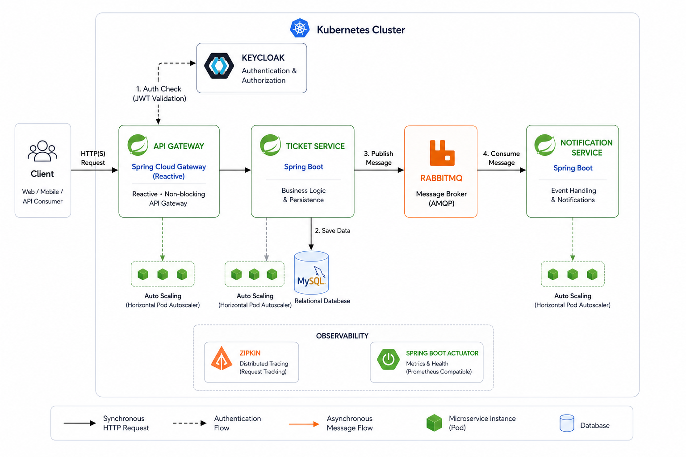

# Microservices Infrastructure

A sample microservices infrastructure built with **Spring Boot** and **Spring Cloud**, demonstrating a production-oriented architecture for scalable backend applications.

## Architecture

<p align="center">
  
</p>

## Features

- Reactive API Gateway (Spring Cloud Gateway)
- Retry and Circuit Breaker support
- JWT Authentication and Authorization with Keycloak
- Token Relay between microservices
- Asynchronous messaging with RabbitMQ
- Distributed tracing with Zipkin
- Relational database integration
- Kubernetes deployments
- Horizontal Pod Autoscaler (HPA)
- ConfigMaps and Secrets for externalized configuration
- Docker containerization

The project currently consists of:

- API Gateway
- Ticket Service
- Notification Service
- Keycloak
- RabbitMQ
- Zipkin
- Relational databases

The primary goal of this project is to demonstrate how modern microservices can be deployed, secured, and scaled using Kubernetes while following common cloud-native practices.

---

## 1. Kubernetes Cluster Setup

For local development and testing, **Minikube** is recommended. It provides a lightweight Kubernetes cluster running on a local machine and allows testing Kubernetes resources such as Deployments, Services, ConfigMaps, Secrets, and HPA without requiring a cloud environment.

### Requirements

Install the following tools:

- Docker Desktop
- Minikube
- kubectl

### Start Minikube Cluster

```bash
minikube start --driver=docker
```

Verify the cluster:

```bash
kubectl get nodes
```

Expected output:

```text
NAME       STATUS   ROLES           AGE
minikube   Ready    control-plane   1m
```

### Enable Metrics Server

Horizontal Pod Autoscaler (HPA) requires the Kubernetes Metrics Server.

Enable it in Minikube:

```bash
minikube addons enable metrics-server
```

Verify that it is running:

```bash
kubectl top nodes
```

### Stop / Delete Cluster

Stop:

```bash
minikube stop
```

Delete:

```bash
minikube delete
```

---

## 2. Start Required Services

Before deploying to Kubernetes, start the required infrastructure services using Docker Compose.

From the project root directory:

```bash
docker compose up -d
```

This will start the required services defined in the `docker-compose.yml` file.

---

## 3. Deploy Kubernetes Resources

Each service contains a `k8s` directory with the required Kubernetes manifests.

Before applying them, review the configuration files and update any environment-specific values (such as IP addresses or hostnames) if needed.

Apply the manifests:

```bash
kubectl apply -f k8s/
```

Repeat this step for each service.

---

## 4. Configure API Gateway

The API Gateway uses a Kubernetes ConfigMap for externalized configuration, including the backend service routes.

Before deploying or updating the Gateway, verify that the configured service endpoints match your Kubernetes environment. If you add a new microservice, update the Gateway ConfigMap to include its route.

Forward the Gateway service to your local machine:

```bash
kubectl port-forward service/gateway-service 8504:8504
```

The API Gateway will be available at:

```text
http://localhost:8504
```

---

## 5. Configure Keycloak

After all services are running, configure Keycloak before testing the application.

- Create or import a realm.
- Create a client for the API Gateway.
- Create at least one user.
- Assign the required roles.
- Obtain an access token.
- Include the token in the `Authorization: Bearer <token>` header when calling protected endpoints.

---

## 6. Verify the Deployment

Check that all resources are running correctly:

```bash
kubectl get pods
```

```bash
kubectl get services
```

```bash
kubectl get hpa
```

```bash
kubectl top nodes
```

If all Pods are in the `Running` state and the HPA is available, the application is ready to use.

Distributed traces can be viewed in the Zipkin UI:

```text
http://localhost:9411
```