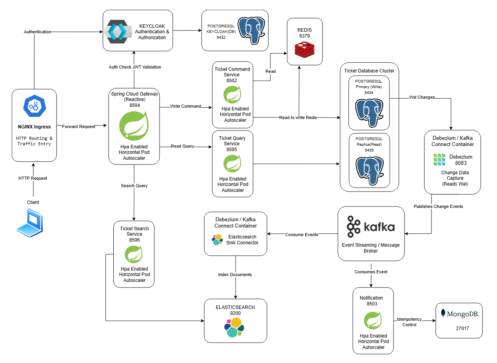

# Microservices Infrastructure


A sample microservices infrastructure built with Spring Boot and Spring Cloud, demonstrating a production-oriented architecture for scalable backend applications.

---

# Architecture

<p align="center">
  
</p>

---

# Features

- Reactive API Gateway (Spring Cloud Gateway)
- Graceful Shutdown, Retry and Circuit Breaker support
- JWT Authentication and Authorization with Keycloak
- Token Relay between microservices
- Event-driven communication with Apache Kafka
- Change Data Capture (CDC) using Debezium
- Distributed tracing with Zipkin
- Prometheus monitoring
- PostgreSQL integration
- Kubernetes deployments
- Horizontal Pod Autoscaler (HPA)
- ConfigMaps and Secrets for externalized configuration
- Docker containerization
- CI/CD pipeline with GitHub Actions
- Automated Docker image build and push to Docker Hub
- MongoDB integration for Notification Service
- Idempotency control for duplicate event processing
- Automated Integration Testing: End-to-end verification for database operations and event workflows.
- CQRS architecture with separated command and query services
- PostgreSQL primary/read replica architecture
- Elasticsearch-based ticket search
- Redis caching for query operations
- Cache-Aside pattern with TTL and LRU eviction

---

# Project Structure

The project currently consists of:

- API Gateway
- Ticket Service (Command)
- Ticket Service Query (Query)
- Ticket Search Service (Search)
- Notification Service
- Kafka
- Debezium
- Keycloak
- Zipkin
- PostgreSQL Cluster
- MongoDB
- Redis

---

# Event Flow

The Ticket Service writes to PostgreSQL Primary.
PostgreSQL changes are captured by Debezium and published to Kafka.
The Elasticsearch Sink Connector consumes these events and indexes them into Elasticsearch.
Notification Service consumes events from Kafka for notification processing.

---

# Kubernetes Cluster Setup

For local development and testing, Minikube is recommended.

It provides a lightweight Kubernetes cluster capable of running Deployments, Services, ConfigMaps, Secrets and Horizontal Pod Autoscaler without requiring a cloud provider.

## Requirements

Install:

- Docker Desktop
- Minikube
- kubectl

Start Minikube:

```bash
minikube start --driver=docker
```

Verify the cluster:

```bash
kubectl get nodes
```

Expected output:

```text
NAME        STATUS   ROLES           AGE
minikube    Ready    control-plane   1m
```

---

## Enable Metrics Server

Horizontal Pod Autoscaler requires Metrics Server.

Enable it:

```bash
minikube addons enable metrics-server
```

Verify:

```bash
kubectl top nodes
```

---

## Stop/Delete Cluster

Stop:

```bash
minikube stop
```

Delete:

```bash
minikube delete
```

---

# Start Required Infrastructure

Start all required infrastructure services.

```bash
docker compose up -d
```

This starts:

- PostgreSQL Primary
- PostgreSQL Read Replica
- Redis
- Elasticsearch
- MongoDB
- Kafka
- Debezium
- Kafka Connect
- Keycloak
- Zipkin
- Kafdrop

---

# PostgreSQL Configuration

Ticket Service uses PostgreSQL.

Example schema:

```sql
CREATE TABLE tickets (
    id VARCHAR(36) PRIMARY KEY,
    description VARCHAR(600),
    notes VARCHAR(1000),
    assignee VARCHAR(50),
    ticket_date TIMESTAMP,
    priority_type INTEGER,
    ticket_status INTEGER,
    created_at TIMESTAMP,
    updated_at TIMESTAMP
);

CREATE TABLE outbox_events (
    id VARCHAR(36) PRIMARY KEY,
    aggregate_type      VARCHAR(255) NOT NULL,
    aggregate_id        VARCHAR(255) NOT NULL,
    event_type          VARCHAR(255) NOT NULL,
    payload             JSONB NOT NULL,

    -- B3 Trace
    trace_id            VARCHAR(32) NOT NULL,
    span_id             VARCHAR(16) NOT NULL,

    sampled             VARCHAR(1) NOT NULL DEFAULT '1',

    db_committed_at     TIMESTAMPTZ NOT NULL DEFAULT now()
);

ALTER TABLE outbox_events REPLICA IDENTITY FULL;
```

To allow Debezium to capture UPDATE and DELETE operations correctly, configure Replica Identity.

---

# Configure Debezium

Connector files are located in the `connectors` directory.

Apply the connectors in this order:

1. `ticket-outbox-connector.json`
2. `ticket-elasticsearch-sink.json`

**Windows:**

```bash
curl.exe -X POST http://localhost:8083/connectors -H "Content-Type: application/json" --data-binary "@connectors/ticket-outbox-connector.json"
curl.exe -X POST http://localhost:8083/connectors -H "Content-Type: application/json" --data-binary "@connectors/ticket-elasticsearch-sink.json"
```

**Ubuntu:**

```bash
curl -X POST http://localhost:8083/connectors \
  -H "Content-Type: application/json" \
  --data-binary @connectors/ticket-outbox-connector.json

curl -X POST http://localhost:8083/connectors \
  -H "Content-Type: application/json" \
  --data-binary @connectors/ticket-elasticsearch-sink.json
```

---

# Deploy Kubernetes Resources

Each service contains a `k8s` directory.

Before deploying, verify configuration values such as hostnames and IP addresses if your environment differs.

Deploy:

```bash
kubectl apply -f k8s/
```

Repeat for every service.

---

# Configure Ingress

Enable the NGINX Ingress Controller in Minikube:

```bash
minikube addons enable ingress
```

Apply the Ingress manifest:

```bash
kubectl apply -f k8s/ingress.yaml
```

The NGINX Ingress Controller manages external access and routes traffic to services within the cluster.

When adding a new service, update the Ingress resource rules with the appropriate host and path mappings.

For local access, expose the Ingress Controller using either:

```bash
minikube tunnel
```

or:

```bash
kubectl port-forward -n ingress-nginx svc/ingress-nginx-controller 80:80
```

The following local domains are used:

- `http://apigateway.test`
- `http://auth.test`

Add the following entries to your local hosts file (`/etc/hosts` or `C:\Windows\System32\drivers\etc\hosts`):

```text
127.0.0.1 auth.test
127.0.0.1 apigateway.test
```

Deployments requiring access through the local domain names use `hostAliases` to route requests to the Minikube host.

Get the Minikube IP with:

```bash
minikube ip
```

Update the `hostAliases` section in your deployment manifests with the returned IP:

```yaml
hostAliases:
  - ip: "192.168.49.2"
    hostnames:
      - "apigateway.test"
      - "auth.test"
```

Replace `192.168.49.2` with the IP returned by `minikube ip`.

---

# Configure Keycloak

After all services are running:

- Create or import a Realm
- Create an API Gateway Client
- Create at least one User
- Assign the required Roles
- Obtain an Access Token

Use the token in requests:

```text
Authorization: Bearer <access_token>
```

---

# Prometheus Monitoring

Create the monitoring namespace:

```bash
kubectl create namespace monitoring
```

Install the Prometheus Operator CRDs:

```bash
kubectl apply --server-side -f [https://raw.githubusercontent.com/prometheus-operator/prometheus-operator/main/example/prometheus-operator-crd/stripped-down-crds.yaml](https://raw.githubusercontent.com/prometheus-operator/prometheus-operator/main/example/prometheus-operator-crd/stripped-down-crds.yaml)
```

Add the Helm repository:

```bash
helm repo add prometheus-community [https://prometheus-community.github.io/helm-charts](https://prometheus-community.github.io/helm-charts)
helm repo update
```

Install the monitoring stack:

```bash
helm install prometheus prometheus-community/kube-prometheus-stack \
    --namespace monitoring \
    --create-namespace
```

The Gateway exposes metrics through:

```text
/actuator/prometheus
```

which can be scraped by Prometheus using a ServiceMonitor.

---

# Verify Deployment

Verify that every component is running correctly:

```bash
kubectl get pods
kubectl get services
kubectl get hpa
kubectl top nodes
```

If all Pods are in the `Running` state and HPA is available, the application is ready.

---

# Zipkin

Distributed traces can be viewed at:

```text
http://localhost:9411
```

---


# Testing

The project includes automated unit and integration tests to ensure code quality and system reliability.

Tests are executed automatically during the Maven build process:

```bash
mvn clean package
```

---

# Technology Stack

- Spring Boot
- Spring Cloud Gateway
- Spring Security
- Keycloak
- PostgreSQL
- MongoDB
- Apache Kafka
- Debezium
- Kubernetes
- Docker
- Zipkin
- Prometheus

---

# CI/CD Pipeline

The project uses GitHub Actions for automated Docker image build and push.

On every push to the main branch:

1. GitHub Actions workflow is triggered.
2. Docker images are built for each microservice.
3. Images are pushed to Docker Hub.
4. Kubernetes deployments can pull the updated images.

Pipeline flow:

```text
GitHub Repository
        │
        ▼
GitHub Actions
        │
        ▼
Docker Build
        │
        ▼
Docker Hub
        │
        ▼
Kubernetes Deployment
```

Docker images:

- `ysfaksn/api-gateway`
- `ysfaksn/ticket-service`
- `ysfaksn/notification-service`

Workflow file:

`.github/workflows/docker.yml`
